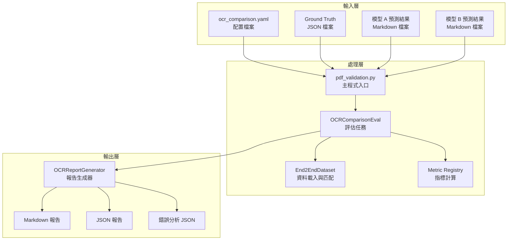
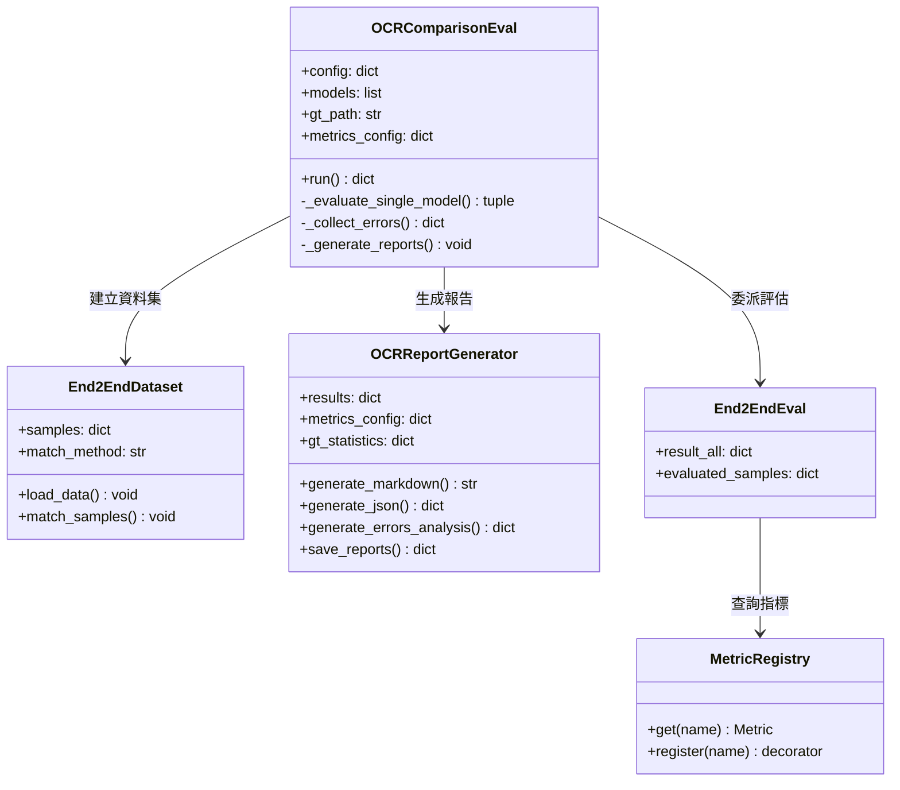
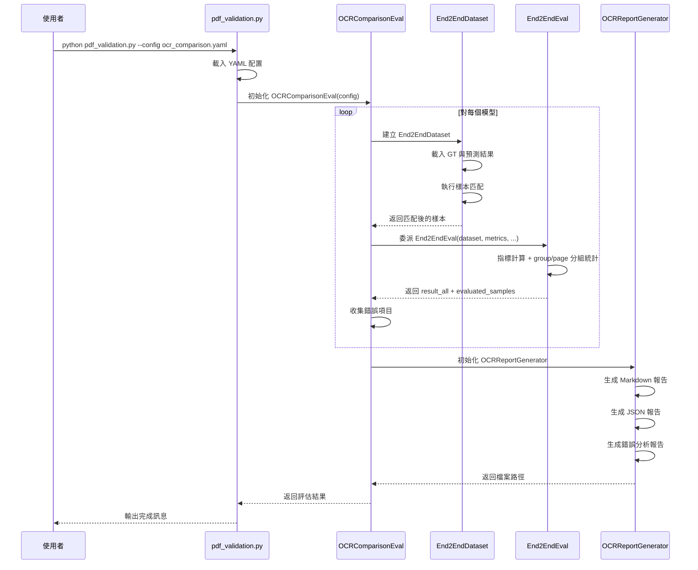

# OCR 多模型比較評估任務技術指南

本文件詳細說明 OmniDocBench 專案中新增的 OCR 多模型比較評估任務（`ocr_comparison_eval`），包含系統架構、使用方法、技術細節及實際範例。

## 目錄

1. [功能概述](#功能概述)
2. [系統架構](#系統架構)
3. [核心元件](#核心元件)
4. [配置說明](#配置說明)
5. [執行流程](#執行流程)
6. [輸出報告解析](#輸出報告解析)
7. [指標說明](#指標說明)
8. [使用範例](#使用範例)
9. [擴展指南](#擴展指南)

## 功能概述

`ocr_comparison_eval` 是一個專為多模型 OCR 評估設計的任務，能夠：

- 同時評估多個 OCR 模型的預測結果
- 計算 Ground Truth 統計資訊（總頁數、各元素類型數量）
- 依照文件來源類型（`data_source`）分類統計效能
- 收集並分析錯誤項目，區分「未匹配」與「錯誤匹配」
- 自動生成 Markdown、JSON 及錯誤分析報告

### 適用場景

- 比較不同 OCR 引擎（如 PaddleOCR、DeepSeek-OCR）的效能差異
- 分析模型在不同文件類型上的表現
- 找出模型的弱點與改進方向
- 建立 OCR 效能基準線

## 系統架構

### 整體架構圖



### 元件關係圖



## 核心元件

### OCRComparisonEval（評估任務）

**檔案位置**：`task/ocr_comparison_eval.py`

此類別是評估任務的核心，負責協調資料載入、指標計算及報告生成。

**主要功能**：

| 方法 | 說明 |
|------|------|
| `__init__(config)` | 初始化配置並執行評估 |
| `_load_page_info()` | 載入頁面資訊供錯誤分析的 `data_source` 分類 |
| `_get_gt_statistics()` | 計算 Ground Truth 元素統計 |
| `_evaluate_single_model(model)` | 評估單一模型 |
| `_collect_errors(samples_dict)` | 收集錯誤項目 |
| `run()` | 執行多模型評估流程 |

### OCRReportGenerator（報告生成器）

**檔案位置**：`metrics/report_generator.py`

負責將評估結果轉換為各種格式的報告。

**支援的報告類型**：

1. **Markdown 報告** (`.md`)
   - 人類可讀的表格格式
   - 包含總覽、分類統計、指標說明

2. **JSON 報告** (`.json`)
   - 結構化資料格式
   - 適合程式化處理

3. **錯誤分析報告** (`_errors.json`)
   - 詳細錯誤項目清單
   - 包含 GT 文本、預測文本、錯誤類型

### End2EndEval（指標評估委派）

**檔案位置**：`task/end2end_run_eval.py`

`OCRComparisonEval` 將指標計算和分組統計委派給 `End2EndEval`，透過其兩個公開屬性取得結果：

| 屬性 | 說明 |
|------|------|
| `result_all` | 各元素類型的評估結果，格式為 `{element_type: {"all": {...}, "group": {...}, "page": {...}}}` |
| `evaluated_samples` | 各元素類型評估後的樣本列表，格式為 `{element_type: list[dict]}` |

`End2EndEval` 內部使用 `get_full_labels_results()` 產生 Annotation Attribute 分組（`group`），使用 `get_page_split()` 產生 Page Attribute 分組（`page`，包含按 `data_source`、`language`、`layout` 等頁面屬性細分的指標值）。

## 配置說明

### 配置檔案結構

配置檔案採用 YAML 格式，位於 `configs/ocr_comparison.yaml`：

```yaml
ocr_comparison_eval:
  # 待評估的模型列表
  models:
    - name: PaddleOCR
      prediction_path: ./doc_ocr_dataset/paddleocr-merged
    - name: DeepSeek-OCR
      prediction_path: ./doc_ocr_dataset/deepseek-ocr-merged

  # Ground Truth 設定
  ground_truth:
    data_path: ./doc_ocr_dataset/omnidocbench_1211_132_fixed.json

  # 匹配方法
  match_method: quick_match

  # 指標設定
  metrics:
    text_block:
      metric:
        - Edit_dist
    display_formula:
      metric:
        - Edit_dist
    table:
      metric:
        - TEDS
        - Edit_dist
    reading_order:
      metric:
        - Edit_dist

  # 輸出設定
  output:
    generate_markdown: true
    generate_json: true
    generate_errors: true
    output_dir: ./result
    report_name: ocr_comparison_report
```

### 配置參數說明

| 參數 | 類型 | 說明 |
|------|------|------|
| `models` | list | 模型清單，每個模型需指定 `name` 和 `prediction_path` |
| `ground_truth.data_path` | string | Ground Truth JSON 檔案路徑 |
| `match_method` | string | 匹配方法：`quick_match`、`simple_match`、`no_split` |
| `metrics` | dict | 各元素類型的指標配置 |
| `output.generate_markdown` | bool | 是否生成 Markdown 報告 |
| `output.generate_json` | bool | 是否生成 JSON 報告 |
| `output.generate_errors` | bool | 是否生成錯誤分析報告 |
| `output.output_dir` | string | 輸出目錄 |
| `output.report_name` | string | 報告檔案基礎名稱 |

## 執行流程

### 流程圖



### 執行指令

```bash
python pdf_validation.py --config configs/ocr_comparison.yaml
```

## 輸出報告解析

### Markdown 報告結構

報告包含以下區塊：

#### 1. 資料集概覽

顯示評估資料集的基本資訊：

| 項目 | 數值 |
|------|------|
| 總頁數 | 132 |
| Ground Truth 來源 | omnidocbench_1211_132_fixed.json |

#### 2. Ground Truth 元素統計與匹配率

顯示各元素類型的 GT 總數與各模型的匹配數量及比例：

| 元素類型 | GT 總數 | PaddleOCR | DeepSeek-OCR |
|----------|---------|-----------|--------------|
| text_block | 1452 | 1291 (88.9%) | 1298 (89.4%) |
| display_formula | 6 | 6 (100.0%) | 0 (0.0%) |
| table | 101 | 97 (96.0%) | 97 (96.0%) |
| reading_order | 132 | 123 (93.2%) | 123 (93.2%) |

#### 3. 總覽表格

各元素類型的整體指標值，Edit_dist 顯示三個子指標：

- `ALL_page_avg`：頁面層級平均編輯距離
- `edit_whole`：整體編輯距離（所有字元合併計算）
- `edit_sample_avg`：樣本層級平均編輯距離

#### 4. 按 Annotation Attribute 分類統計

依照 GT 標註的屬性（如 `text_background`、`text_language`、`text_rotate`）細分的指標值，含各屬性的樣本數量。

#### 5. 按 Page Attribute 分類統計

依照頁面屬性（如 `data_source`、`language`、`layout`）細分的指標值，`ALL` 列為全域平均。有助於了解模型在不同文件來源類型上的表現差異。

### JSON 報告結構

```json
{
  "generated_at": "2025-12-16T13:51:49.344680",
  "config": {
    "metrics": {
      "text_block": ["Edit_dist"],
      "display_formula": ["Edit_dist"],
      "table": ["TEDS", "Edit_dist"],
      "reading_order": ["Edit_dist"]
    }
  },
  "dataset_overview": {
    "total_pages": 132,
    "gt_source": "omnidocbench_1211_132_fixed.json",
    "elements": {
      "text_block": 1452,
      "display_formula": 6,
      "table": 101,
      "reading_order": 132
    }
  },
  "models": {
    "PaddleOCR": {
      "elements": {
        "text_block": {
          "sample_count": 1291,
          "all": { "Edit_dist": { "ALL_page_avg": 0.1323, "edit_whole": 0.1552, "edit_sample_avg": 0.1310 } },
          "group": { "Edit_dist": { "text_background: white": 0.131 }, "sample_count": { "text_background: white": 1291 } },
          "page": { "Edit_dist": { "ALL": 0.1323, "data_source: paper": 0.0608 } }
        }
      }
    }
  }
}
```

### 錯誤分析報告結構

錯誤分析報告包含兩個主要區塊：

#### 摘要區塊（summary）

```json
{
  "summary": {
    "text_block": {
      "gt_total": 1452,
      "models": {
        "PaddleOCR": {
          "total_samples": 1291,
          "error_count": 371,
          "unmatched_count": 99,
          "mismatched_count": 272,
          "accuracy": 0.7126
        }
      }
    }
  }
}
```

#### 詳細錯誤項目（errors_by_data_source）

```json
{
  "errors_by_data_source": {
    "PaddleOCR": {
      "text_block": {
        "paper": {
          "count": 16,
          "items": [
            {
              "img_id": "034001_page-0027.jpg",
              "edit_dist": 0.4706,
              "gt_text": "表 3 各國股市資料取樣區間及資料筆數",
              "pred_text": "## 表 3 各国股市资料取样区间及资料笔数",
              "error_type": "mismatched",
              "gt_attribute": {
                "text_language": "text_traditional_chinese"
              }
            }
          ]
        }
      }
    }
  }
}
```

**錯誤類型說明**：

| 類型 | 說明 |
|------|------|
| `unmatched` | 模型未輸出對應內容（預測為空） |
| `mismatched` | 模型有輸出但內容不正確 |

## 指標說明

### Edit_dist（編輯距離）

歸一化編輯距離，衡量預測文本與 GT 文本的差異程度。

- **數值範圍**：0 到 1
- **解讀**：越低越好（0 表示完全相同）
- **準確率**：1 - Edit_dist

**子指標說明**：

| 子指標 | 計算方式 | 適用場景 |
|--------|----------|----------|
| `ALL_page_avg` | 各頁面編輯距離的平均值 | 評估頁面級表現 |
| `edit_whole` | 所有字元合併後的編輯距離 | 整體評估 |
| `edit_sample_avg` | 各樣本編輯距離的平均值 | 評估樣本級表現 |

### TEDS（表格編輯距離相似度）

Tree Edit Distance Similarity，專門用於評估表格結構的相似度。

- **數值範圍**：0 到 1
- **解讀**：越高越好（1 表示結構完全相同）

### 其他支援的指標

| 指標 | 說明 | 數值範圍 |
|------|------|----------|
| CDM | 公式字元偵測匹配分數 | 0-1，越高越好 |
| BLEU | 機器翻譯評估指標 | 0-1，越高越好 |
| METEOR | 機器翻譯評估指標 | 0-1，越高越好 |

## 使用範例

### 範例 1：基本使用

執行多模型比較評估：

```bash
python pdf_validation.py --config configs/ocr_comparison.yaml
```

輸出結果：

```
評估模型: PaddleOCR
預測結果目錄: ./doc_ocr_dataset/paddleocr-merged
  評估 text_block: 1291 個樣本
    整體指標: {'Edit_dist': 0.1552}
  評估 table: 97 個樣本
    整體指標: {'TEDS': 0.6417, 'Edit_dist': 0.2407}

評估模型: DeepSeek-OCR
預測結果目錄: ./doc_ocr_dataset/deepseek-ocr-merged
...

Markdown 報告已儲存至: ./result/ocr_comparison_report.md
JSON 報告已儲存至: ./result/ocr_comparison_report.json
錯誤分析報告已儲存至: ./result/ocr_comparison_report_errors.json
```

### 範例 2：分析實際報告

以下是從實際報告中擷取的效能比較分析：

**text_block 效能比較**：

| 文件類型 | PaddleOCR 準確率 | DeepSeek-OCR 準確率 | 勝出 |
|----------|------------------|---------------------|------|
| 學術論文 | 95.04% | 95.47% | DeepSeek-OCR |
| 簡報投影片 | 93.04% | 55.94% | PaddleOCR |
| 手寫文件 | 79.26% | 52.11% | PaddleOCR |
| 電子書 | 94.81% | 91.06% | PaddleOCR |
| 表格表單 | 51.56% | 81.30% | DeepSeek-OCR |

**分析結論**：

- PaddleOCR 在大多數文件類型上表現較佳
- DeepSeek-OCR 在學術論文和表格表單上略勝
- 兩者在手寫文件上都有改進空間

### 範例 3：自訂配置

只評估特定指標：

```yaml
ocr_comparison_eval:
  models:
    - name: MyOCR
      prediction_path: ./my_ocr_results

  ground_truth:
    data_path: ./my_ground_truth.json

  match_method: quick_match

  metrics:
    text_block:
      metric:
        - Edit_dist
        - BLEU
        - METEOR

  output:
    generate_markdown: true
    generate_json: false
    generate_errors: false
    output_dir: ./my_results
    report_name: my_ocr_report
```

## 擴展指南

### 新增評估指標

1. 在 `metrics/` 目錄下建立指標類別
2. 使用 `@METRIC_REGISTRY.register("metric_name")` 註冊
3. 實作 `evaluate()` 方法
4. 在配置檔案中引用

```python
from registry.registry import METRIC_REGISTRY

@METRIC_REGISTRY.register("my_metric")
class MyMetric:
    def __init__(self, samples):
        self.samples = samples

    def evaluate(self, group_info=None, save_name=""):
        # 計算指標
        results = {"my_metric": {"all": 0.95}}
        return self.samples, results
```

### 新增文件來源分類

Annotation Attribute 和 Page Attribute 統計會自動從 GT 資料中提取所有屬性鍵，無需手動新增分類。若需要在**錯誤分析報告**中自訂分類排序，修改 `metrics/report_generator.py` 中的 `CATEGORY_ORDER`：

```python
CATEGORY_ORDER = [
    "paper",
    "presentation",
    "handwriting",
    "receipt",
    "eBook",
    "finance",
    "form",
    "my_new_category",  # 新增分類
]
```

### 自訂報告格式

繼承 `OCRReportGenerator` 類別並覆寫生成方法：

```python
class MyReportGenerator(OCRReportGenerator):
    def generate_markdown(self):
        # 自訂 Markdown 格式
        pass

    def generate_custom_format(self):
        # 新增自訂格式
        pass
```

## 技術規格

### 系統需求

- Python 3.8+
- 依賴套件：pandas, numpy, tabulate, pyyaml

### 檔案結構

```
OmniDocBench/
├── configs/
│   └── ocr_comparison.yaml      # 評估配置
├── task/
│   ├── __init__.py              # 任務註冊
│   └── ocr_comparison_eval.py   # 評估任務實作
├── metrics/
│   ├── report_generator.py      # 報告生成器
│   └── show_result.py           # 結果顯示工具
└── result/                      # 輸出目錄
    ├── ocr_comparison_report.md
    ├── ocr_comparison_report.json
    └── ocr_comparison_report_errors.json
```

### API 參考

#### OCRComparisonEval

```python
class OCRComparisonEval:
    """OCR 多模型比較評估任務"""

    def __init__(self, config: dict):
        """
        初始化並執行評估任務

        Args:
            config: 配置字典，包含 models、ground_truth、metrics、output 等設定
        """

    def run(self) -> dict[str, Any]:
        """
        執行多模型評估

        Returns:
            所有模型的評估結果字典
        """
```

#### OCRReportGenerator

```python
class OCRReportGenerator:
    """OCR 評估報告生成器"""

    def __init__(
        self,
        results: dict,
        metrics_config: dict,
        gt_statistics: dict | None = None,
        errors_data: dict | None = None,
    ):
        """初始化報告生成器"""

    def generate_markdown(self) -> str:
        """生成 Markdown 格式報告"""

    def generate_json(self) -> dict:
        """生成 JSON 結構化報告"""

    def generate_errors_analysis(self) -> dict:
        """生成錯誤分析報告"""

    def save_reports(
        self,
        output_dir: str,
        base_name: str = "ocr_comparison_report",
        generate_markdown: bool = True,
        generate_json: bool = True,
        generate_errors: bool = True,
    ) -> dict[str, str]:
        """儲存報告到檔案"""
```

---

**文件版本**：1.0.0
**最後更新**：2025-01-27
