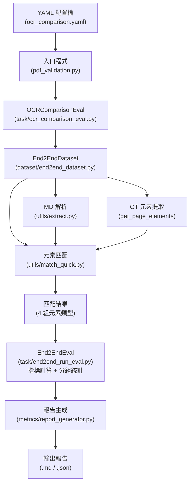
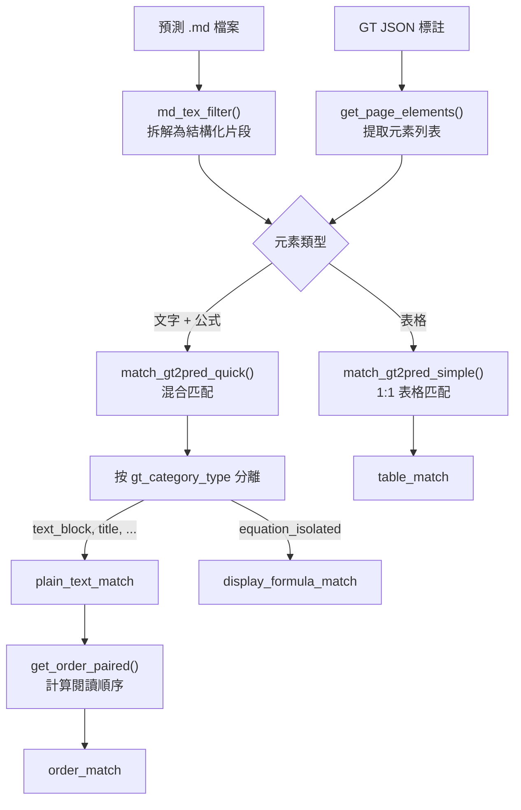
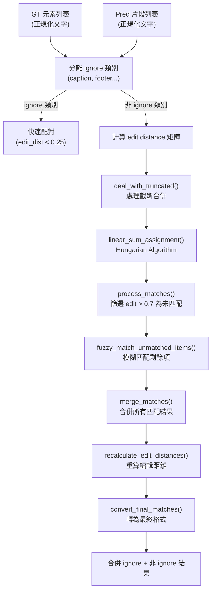
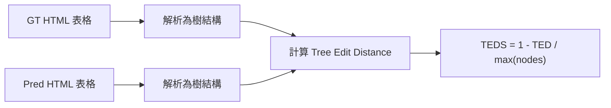
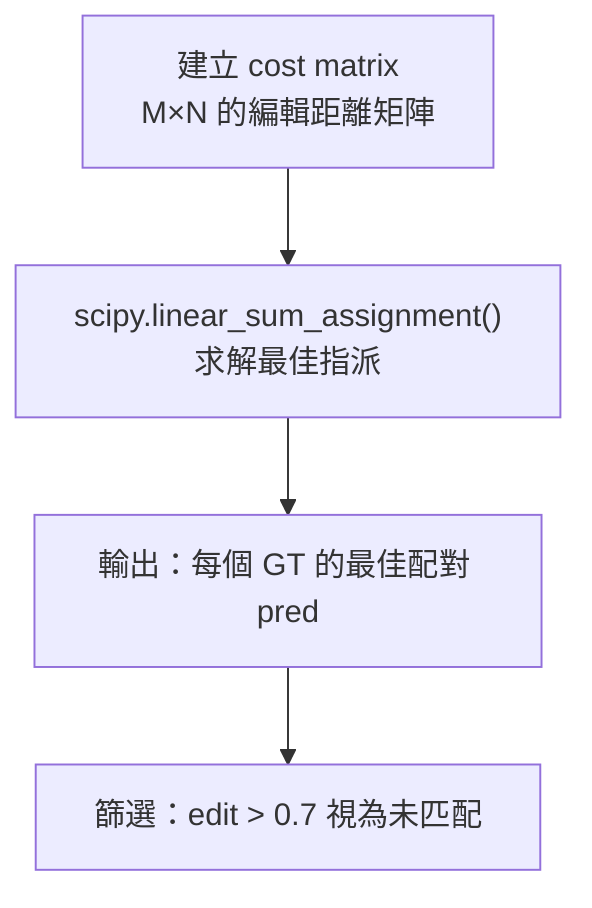
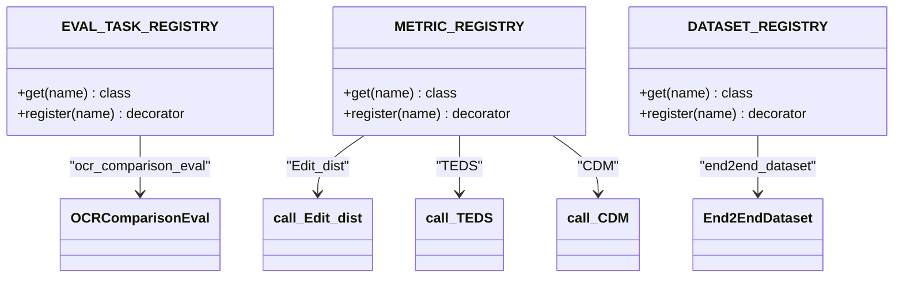
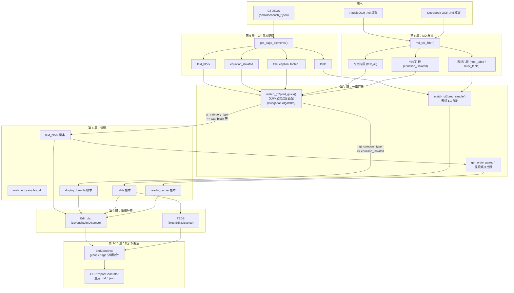

# OCR 多模型比較評估管道技術文件

## 概覽

OmniDocBench 的 OCR 比較評估管道（`ocr_comparison_eval`）用於同時評估多個 OCR 模型的辨識效能。此管道接收各模型的 Markdown 預測輸出與 Ground Truth (GT) 標註 JSON，透過**元素級匹配**（element-level matching）將預測內容與 GT 逐一配對，最終產出包含多種指標的比較報告。

### 為什麼是「元素級」而非「頁面級」

此管道的設計核心是**元素級評估**。你提供的 `.md` 檔案（整頁 OCR 輸出）會在管道內被拆解為結構化片段（文字段、公式、表格），再與 GT JSON 中的個別標註元素進行 1:1 配對。這意味著：

- **評估基本單位是元素**（一個文字塊、一個公式、一張表格），而非整頁文字
- 報告呈現的樣本數（如 `text_block: 1291`）代表的是匹配到的**文字塊數量**，不是頁面數量
- 這種設計讓你能夠區分模型在不同元素類型上的表現差異

## 系統架構總覽



## 完整 Call Stack

以下依呼叫順序逐層說明，每層標註對應的**檔案路徑**與**函式名稱**。

### 第 1 層：程式入口

**檔案**：`pdf_validation.py:25-49`

```python
# 執行指令
python pdf_validation.py --config configs/ocr_comparison.yaml
```

入口程式讀取 YAML 配置檔，解析頂層 key。當遇到 `ocr_comparison_eval` 時，透過 Registry Pattern 取得對應的任務類別並實例化：

```python
# pdf_validation.py:46-48
if task_name == "ocr_comparison_eval":
    val_task = EVAL_TASK_REGISTRY.get(task_name)
    val_task(task_config)
```

### 第 2 層：任務初始化

**檔案**：`task/ocr_comparison_eval.py`
**類別**：`OCRComparisonEval`

#### `__init__()` — 第 29-47 行

```python
def __init__(self, config):
    self.page_info = self._load_page_info()   # 載入 GT，建立頁面屬性字典
    self.results = self.run()                  # 啟動評估流程
```

#### `_load_page_info()` — 第 49-61 行

讀取 GT JSON，為每頁建立 `{圖片名稱: page_attribute}` 字典。`page_attribute` 包含 `data_source`（如 paper、handwriting）等分類資訊，後續用於分類統計。

### 第 3 層：多模型評估迴圈

**檔案**：`task/ocr_comparison_eval.py`
**函式**：`run()` — 第 299-328 行

```python
def run(self):
    for model in self.models:
        result, samples_dict = self._evaluate_single_model(model)
        all_errors[model_name] = self._collect_errors(samples_dict)

    gt_statistics = self._get_gt_statistics()
    self._generate_reports(all_results, gt_statistics, all_errors)
```

此層遍歷配置中的每個模型（如 PaddleOCR、DeepSeek-OCR），對每個模型執行完整的評估流程。

### 第 4 層：單模型評估

**檔案**：`task/ocr_comparison_eval.py`
**函式**：`_evaluate_single_model()` — 第 190-228 行

此函式委派 `End2EndEval` 執行指標計算與分組統計：

```python
def _evaluate_single_model(self, model):
    # 步驟 1：建立配置並載入 End2EndDataset
    single_config = self._build_single_model_config(model)
    dataset = DATASET_REGISTRY.get("end2end_dataset")(single_config)

    # 步驟 2：委派給 End2EndEval 執行指標評估
    eval_instance = End2EndEval(
        dataset=dataset,
        metrics_list=self.metrics_config,
        page_info_path=self.gt_path,
        save_name=model_name,
    )

    # 步驟 3：讀取 End2EndEval 的結果結構（all / group / page）
    for element_type, element_data in eval_instance.result_all.items():
        model_result["elements"][element_type] = {
            "sample_count": len(sample_list),
            "all": element_data.get("all", {}),
            "group": element_data.get("group", {}),
            "page": element_data.get("page", {}),
        }
```

`End2EndEval` 內部為每個元素類型（`text_block`、`display_formula`、`table`、`reading_order`）執行指標計算，並透過 `get_full_labels_results()` 和 `get_page_split()` 產生 Annotation Attribute（`group`）和 Page Attribute（`page`）分組統計。

### 第 5 層：資料集載入與元素匹配

**檔案**：`dataset/end2end_dataset.py`
**類別**：`End2EndDataset`

這是將 `.md` 預測檔轉換為元素級匹配結果的核心。

#### `__init__()` — 第 23-45 行

```python
def __init__(self, cfg_task):
    gt_samples = json.load(gt_path)
    self.samples = self.get_matched_elements(gt_samples, pred_folder)
```

#### `get_matched_elements()` — 第 153-250 行

遍歷每一頁 GT，載入對應的 `.md` 預測檔，呼叫 `process_get_matched_elements()` 進行匹配，最終將所有頁面的結果按元素類型分組：

```python
matched_samples_all = {
    'text_block':      RecognitionEnd2EndBaseDataset(plain_text_match),
    'display_formula': RecognitionEnd2EndBaseDataset(display_formula_match),
    'table':           RecognitionEnd2EndTableDataset(table_match, table_format),
    'reading_order':   RecognitionEnd2EndBaseDataset(order_match),
}
```

**此處就是「元素級結果」的產生位置**——回傳的 dict 以元素類型為 key，每個 value 是該類型所有「GT ↔ 預測」配對的列表。

#### `process_get_matched_elements()` — 第 253-340 行

單頁匹配的核心邏輯：



程式碼流程：

1. **解析預測 .md**：呼叫 `md_tex_filter(pred_content)`（第 264 行）
2. **提取 GT 元素**：呼叫 `self.get_page_elements(sample)`（第 265 行）
3. **表格匹配**：使用 `match_gt2pred_simple()` 進行 1:1 配對（第 292-299 行）
4. **混合匹配**：將所有非表格的 GT 元素（text_block、title、formula、caption 等）與所有非表格的預測片段一起進行 `match_gt2pred_quick()` 匹配（第 305 行）
5. **分離結果**：根據 `gt_category_type` 將配對結果分為 `plain_text_match_s` 和 `display_formula_match_s`（第 316-323 行）
6. **過濾忽略類型**：移除 caption、footer、page_number 等不納入評估的類型（第 333 行）
7. **計算閱讀順序**：呼叫 `get_order_paired()` 比對預測與 GT 的閱讀順序（第 337 行）

### 第 6 層：MD 解析

**檔案**：`utils/extract.py`
**函式**：`md_tex_filter()` — 第 111-392 行

此函式將一頁 `.md` 內容拆解為結構化片段。處理順序（後提取的不會重複處理已提取的部分）：

| 步驟 | 提取內容 | 輸出類別 |
|------|----------|----------|
| 1 | LaTeX 表格（`\begin{tabular}`） | `latex_table` |
| 2 | HTML 表格（`<table>`） | `html_table` |
| 3 | Display 公式（`$$...$$`、`\[...\]`） | `equation_isolated` |
| 4 | Markdown 表格（`|...|`） | `html_table`（先轉 HTML） |
| 5 | 程式碼區塊（` ```...``` `） | `text_all` |
| 6 | 剩餘文字（以 `\n\n` 分段） | `text_all` |

每提取一種元素後，該段內容會被替換為等長的空格，確保不被後續步驟重複處理。

### 第 7 層：匹配演算法

**檔案**：`utils/match_quick.py`
**函式**：`match_gt2pred_quick()` — 第 265-611 行

此函式使用 **Hungarian Algorithm**（匈牙利演算法）進行最佳配對。



每個匹配結果的資料結構：

```python
{
    'gt_idx': [0],                    # GT 索引
    'gt': '原始 GT 文字',
    'pred_idx': [3],                  # 預測索引
    'pred': '預測文字',
    'gt_category_type': 'text_block', # GT 類別
    'pred_category_type': 'text_all', # 預測類別
    'edit': 0.15,                     # 正規化編輯距離
    'img_id': 'page_001.jpg',         # 頁面識別
    'gt_position': [3],               # GT 閱讀順序
    'pred_position': 42,              # 預測位置
}
```

### 第 8 層：指標計算

**檔案**：`metrics/cal_metric.py`

#### Edit Distance — `call_Edit_dist.evaluate()` — 第 143-184 行

```python
def evaluate(self):
    for sample in samples:
        edit_dist = Levenshtein.distance(pred, gt)
        sample['metric']['Edit_dist'] = edit_dist / max(len(pred), len(gt))

    # 三種聚合方式
    return {
        'Edit_dist': {
            'ALL_page_avg':    up_total_avg.mean(),   # 頁面級加權平均
            'edit_whole':      edit_whole,              # 全局加權
            'edit_sample_avg': edit_sample_avg          # 樣本平均
        }
    }
```

#### TEDS — `call_TEDS.evaluate()` — 第 40-96 行

```python
def evaluate(self):
    for sample in samples:
        score = teds.evaluate(pred_html, gt_html)
        sample['metric']['TEDS'] = score

    return {'TEDS': {'all': mean(scores)}}
```

### 第 9 層：分組統計

**檔案**：`metrics/show_result.py`
**函式**：`get_full_labels_results()` — Annotation Attribute 分組、`get_page_split()` — Page Attribute 分組

`End2EndEval` 在計算指標後，自動呼叫這兩個函式產生分組統計：

- **Annotation Attribute（`group`）**：按 GT 標註的屬性（如 `text_background`、`text_language`、`text_rotate`）分組統計指標值
- **Page Attribute（`page`）**：按頁面屬性（如 `data_source`、`language`、`layout`）分組統計指標值，包含一個 `ALL` 全域平均

### 第 10 層：報告生成

**檔案**：`metrics/report_generator.py`
**類別**：`OCRReportGenerator`

| 方法 | 輸出 |
|------|------|
| `generate_markdown()` | `.md` 格式比較報告 |
| `generate_json()` | `.json` 結構化報告 |
| `generate_errors_analysis()` | `_errors.json` 錯誤分析 |

## 技術概念詳解

### Edit Distance（編輯距離）

Edit Distance（Levenshtein Distance）衡量將字串 A 轉換為字串 B 所需的**最少單字元操作數**（插入、刪除、替換）。

**範例**：

```
GT:   "Hello World"
Pred: "Helo Wrold"

操作：
1. 刪除第二個 'l'     → "Helo World"  ← 其實是 "Hello" → "Helo" 需 1 次刪除
2. "World" → "Wrold"  → 交換 'o' 和 'r' 需要 2 次操作（刪除 + 插入）

Edit Distance = 3
正規化 = 3 / max(11, 10) = 3/11 ≈ 0.2727
準確率 = 1 - 0.2727 = 72.73%
```

在此系統中，Edit Distance 有三種聚合方式：

| 聚合方式 | 公式 | 說明 |
|----------|------|------|
| `ALL_page_avg` | `mean(各頁的 Σ edit / Σ upper_len)` | 先算每頁的加權比值，再跨頁取平均 |
| `edit_whole` | `全部 Σ edit / 全部 Σ upper_len` | 全域字元合併計算 |
| `edit_sample_avg` | `mean(各樣本的 edit/upper_len)` | 每個元素各自算比值，再取平均 |

### TEDS（Tree Edit Distance Similarity）

TEDS 專門用於評估**表格結構**的相似度。它將 HTML 表格解析為樹狀結構，計算兩棵樹之間的編輯距離，再轉換為 0-1 的相似度分數。



- **TEDS = 1.0**：預測與 GT 結構完全一致
- **TEDS = 0.0**：結構完全不同
- **TEDS (structure_only)**：僅比較表格結構（行列），忽略儲存格內容

### Hungarian Algorithm（匈牙利演算法）

當有 M 個 GT 元素和 N 個預測片段時，如何找到**最佳的 1:1 配對**使總 edit distance 最小？這就是一個**指派問題**（Assignment Problem），使用 Hungarian Algorithm 求解。



**範例**：假設一頁有 3 個 GT 元素和 4 個 Pred 片段：

```
Cost Matrix (正規化 edit distance):
              Pred_0   Pred_1   Pred_2   Pred_3
GT_0          0.05     0.82     0.91     0.78
GT_1          0.75     0.10     0.88     0.95
GT_2          0.80     0.90     0.12     0.70

Hungarian 求解結果：
GT_0 ↔ Pred_0  (cost: 0.05)
GT_1 ↔ Pred_1  (cost: 0.10)
GT_2 ↔ Pred_2  (cost: 0.12)

Pred_3 未被匹配
```

在實際程式碼中，匹配前還會先處理**文字截斷合併**（`deal_with_truncated()`），將可能被 OCR 拆散的多個預測片段合併後再進行匹配。

### Registry Pattern（登錄模式）

系統使用 Registry Pattern 實現元件的動態管理和解耦。三個核心 Registry：



**使用方式**：

```python
# 註冊
@EVAL_TASK_REGISTRY.register("ocr_comparison_eval")
class OCRComparisonEval:
    ...

# 取得
task_class = EVAL_TASK_REGISTRY.get("ocr_comparison_eval")
task_class(config)  # 實例化
```

這種設計的好處是：YAML 配置中只需寫字串名稱（如 `"Edit_dist"`），系統就能在執行期動態查找對應的類別，無需硬編碼。

## 完整資料流圖



## 檔案對照表

| 功能 | 檔案路徑 | 關鍵函式 |
|------|----------|----------|
| 程式入口 | `pdf_validation.py:25-49` | `__main__` |
| 評估任務 | `task/ocr_comparison_eval.py` | `OCRComparisonEval.__init__()`, `run()`, `_evaluate_single_model()` |
| 資料集載入 | `dataset/end2end_dataset.py` | `End2EndDataset.get_matched_elements()`, `process_get_matched_elements()` |
| MD 解析 | `utils/extract.py` | `md_tex_filter()` |
| 快速匹配 | `utils/match_quick.py` | `match_gt2pred_quick()`, `cal_final_match()`, `deal_with_truncated()` |
| 簡單匹配 | `utils/match.py` | `match_gt2pred_simple()`, `compute_edit_distance_matrix_new()` |
| Edit Distance | `metrics/cal_metric.py:139-184` | `call_Edit_dist.evaluate()` |
| TEDS | `metrics/cal_metric.py:36-96` | `call_TEDS.evaluate()` |
| 分組統計 | `metrics/show_result.py` | `get_full_labels_results()`、`get_page_split()` |
| 指標評估委派 | `task/end2end_run_eval.py` | `End2EndEval.__init__()` |
| 報告生成 | `metrics/report_generator.py` | `OCRReportGenerator.generate_markdown()`, `generate_json()` |
| Registry 定義 | `registry/registry.py` | `EVAL_TASK_REGISTRY`, `METRIC_REGISTRY`, `DATASET_REGISTRY` |

## 配置檔案結構

`configs/ocr_comparison.yaml` 的結構決定了評估範圍：

```yaml
ocr_comparison_eval:
  models:                          # 待評估的模型列表
    - name: PaddleOCR
      prediction_path: ./doc_ocr_dataset/paddleocr-merged
    - name: DeepSeek-OCR
      prediction_path: ./doc_ocr_dataset/deepseek-ocr-merged

  ground_truth:                    # GT 設定
    data_path: ./doc_ocr_dataset/omnidocbench_1211_132_fixed.json

  match_method: quick_match        # 匹配方法

  metrics:                         # 元素類型與指標（決定報告呈現內容）
    text_block:
      metric: [Edit_dist]
    display_formula:
      metric: [Edit_dist]
    table:
      metric: [TEDS, Edit_dist]
    reading_order:
      metric: [Edit_dist]
```

你可以透過註解或取消註解 `metrics` 區塊中的指標來控制評估範圍。新增模型只需在 `models` 列表中加入新條目。
